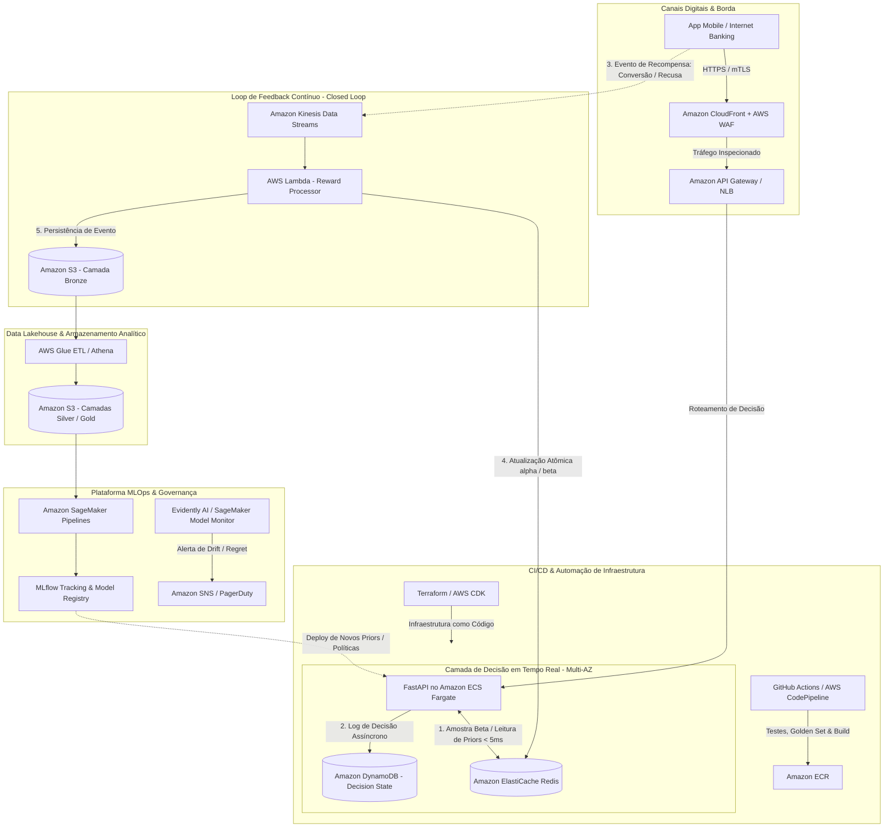

# Otimização Adaptativa de Campanhas de Marketing Bancário

## Visão do Problema
O objetivo deste projeto é projetar uma plataforma de experimentação adaptativa para determinar a melhor estratégia de oferta de produtos financeiros para clientes de um banco. 

Ao invés de utilizar regras fixas que demoram a reagir a mudanças de comportamento ou longos testes A/B que desperdiçam tráfego, utilizaremos uma abordagem adaptativa (como *Multi-Armed Bandit* - ex: Thompson Sampling ou Epsilon-Greedy). Essa técnica permite identificar comportamentos distintos em tempo real, equilibrando a exploração de novas ofertas e a explotação daquelas que já provaram gerar mais conversão, resultando em uma personalização responsável e eficiente.

## Instruções de Execução

1. Clone o repositório.
2. Crie um ambiente virtual (recomendado):
   ```bash
   python -m venv venv
   source venv/bin/activate  # Linux/Mac
   # ou no Windows: venv\Scripts\activate
   ```
3. Instale as dependências:
   ```bash
   pip install -r requirements.txt
   ```
4. Acompanhe os notebooks na pasta `notebooks/` para visualizar a Análise Exploratória (EDA), a preparação dos dados, a criação dos baselines e o treinamento do modelo adaptativo.
5. Para testar o Serviço Demonstrável (API), execute:
   ```bash
   uvicorn app:app --reload
   ```
   E acesse a documentação interativa em: [http://127.0.0.1:8000/docs](http://127.0.0.1:8000/docs)

## Etapas do Projeto
- **Etapa 0:** Organização do Projeto (Concluído)
- **Etapa 1:** Base Kaggle e EDA (Concluído)
  - Base escolhida: [Bank Marketing (Henrique Yamahata)](https://www.kaggle.com/datasets/henriqueyamahata/bank-marketing)
- **Etapa 2:** Preparação da Base (Concluído)
- **Etapa 3:** Baseline e Estratégia Algorítmica (Concluído)
- **Etapa 4:** Avaliação e Casos de Teste (Concluído)
- **Etapa 5:** Serviço ou Interface Demonstrável (Concluído)
- **Etapa 6:** Arquitetura-alvo em Nuvem (Concluído)
- **Etapa 7:** Ciclo de vida MLOps (Concluído)
- **Etapa 8:** Apresentação Final (Concluído - Roteiro em [ROTEIRO_APRESENTACAO_PITCH_5MIN.md](file:///Users/murillo/Documents/FIAP/ML/Módulo%205/TrabalhoFinal/ROTEIRO_APRESENTACAO_PITCH_5MIN.md), Slides interativos em [apresentacao.html](file:///Users/murillo/Documents/FIAP/ML/Módulo%205/TrabalhoFinal/apresentacao.html) e [SLIDES.md](file:///Users/murillo/Documents/FIAP/ML/Módulo%205/TrabalhoFinal/SLIDES.md))


## Casos de Teste (Golden Set - Etapa 4)
Para validar o comportamento do modelo adaptativo contra regras de negócio e garantir que a tomada de decisão faz sentido prático, selecionamos 5 perfis representativos de clientes:

| ID Cliente | Idade | Profissão (Segmento) | Estado Civil | Recomendação do Algoritmo | Análise da Decisão |
|---|---|---|---|---|---|
| **#1** | 57 | `services` | Casado | **Baixa Prioridade** (Baixa propensão) | Segmento com conversão histórica baixa (< 9%); evita fadiga de contato. |
| **#3** | 40 | `admin.` | Casado | **Contato Padrão** (Média propensão) | Segmento volumoso com taxa intermediária (~12%); mantém exploração controlada. |
| **#7** | 41 | `blue-collar` | Casado | **Baixa Prioridade** (Baixa propensão) | Baixo retorno relativo no produto; economiza custo de ligação. |
| **#15** | 54 | `retired` | Casado | **Contato Prioritário** (Alta propensão) | Segmento de aposentados com maior liquidez e conversão (> 25%). |
| **#205** | 35 | `student` | Solteiro | **Contato Prioritário** (Alta propensão) | Estudantes apresentam a maior taxa de conversão proporcional (> 30%). |

*Resultado:* O algoritmo direciona o orçamento e o esforço de contato exatamente para os segmentos de maior tração, maximizando a taxa de conversão final.

## Arquitetura-alvo em Nuvem (AWS) - MLOps de Alta Disponibilidade

Para levar a plataforma adaptativa de marketing bancário para um ambiente de produção corporativo e regulado, projetamos uma **arquitetura de referência robusta, resiliente e escalável na AWS**, seguindo as melhores práticas do *AWS Well-Architected Framework (Machine Learning Lens)* e diretrizes de conformidade bancária (LGPD / BACEN).

A arquitetura resolve os quatro principais desafios de sistemas de recomendação baseados em Multi-Armed Bandit:
1. **Incentivo à exploração em tempo real com ultrabaixa latência (< 30ms p95)**.
2. **Loop de feedback contínuo assíncrono (Closed-Loop Feedback)** para atualização dos parâmetros da distribuição Beta ($\alpha, \beta$) sem bloquear o usuário.
3. **Graceful Degradation e Circuit Breaking** garantindo disponibilidade de 99.99% para canais críticos (App Mobile / Internet Banking).
4. **Governança MLOps ponta a ponta**, com rastreamento de linhagem (MLflow), monitoramento de Drift (Concept/Data Drift) e CI/CD automatizado.

---

### Diagrama da Arquitetura de Referência



---

### Detalhamento dos Componentes e Camadas

#### 1. Camada de Borda, Roteamento e Segurança (Edge & Ingress)
- **AWS WAF & Amazon CloudFront**: Proteção perimetral contra ataques de negação de serviço (DDoS via AWS Shield Standard), mitigação de bots e regras OWASP Top 10.
- **Amazon API Gateway (HTTP APIs)**:
  - Exposição de endpoints RESTful com validação de tokens JWT (OAuth2 via Amazon Cognito ou IdP corporativo do banco).
  - Rate limiting (throttling) e controle de quotas por canal consumidor para isolar tráfego do App Mobile de canais de retaguarda (CRM/Call Center).
  - Suporte a mTLS (Mutual TLS) para comunicação segura entre microsserviços internos.

#### 2. Microsserviço de Decisão e Resiliência (Inference Layer)
- **Amazon ECS com AWS Fargate**:
  - A API FastAPI é empacotada em contêineres Docker leves e executada em múltiplos Availability Zones (Multi-AZ) sem gerenciamento de servidores físicos.
  - **Auto Scaling Dinâmico**: Dimensionamento automático baseado em utilização de CPU, memória e taxa de requisições por segundo (RPS).
- **Estratégia de Graceful Degradation (Fallback)**:
  - Se a consulta ao Redis ou a inferência contextual atingir um timeout de 25ms, o serviço aciona automaticamente um **Circuit Breaker** e serve o braço de maior conversão histórica pré-computado em memória local, garantindo zero indisponibilidade ao cliente final.

#### 3. Estado de Baixa Latência e Feature Store
- **Amazon ElastiCache para Redis (Cluster Multi-AZ)**:
  - Armazena as contagens de vitórias ($\alpha$) e derrotas ($\beta$) de cada braço e de segmentos contextuais de clientes.
  - Oferece tempos de leitura e escrita sub-milissegundo (< 2ms), permitindo que a amostragem de Thompson Sampling ocorra em tempo de execução sem gargalos.
- **Amazon DynamoDB**:
  - Tabela com chave primária composta (`transaction_id` + `customer_id`) e TTL ativado para registrar a recomendação servida e correlacionar posteriormente com o evento de conversão.

#### 4. Loop de Feedback Contínuo (Closed-Loop Feedback)
- **Amazon Kinesis Data Streams**:
  - Quando o cliente clica na oferta, fecha a notificação ou finaliza a contratação do produto bancário, o evento é enviado ao Kinesis de forma assíncrona.
- **AWS Lambda (Processamento de Recompensa)**:
  - Função serverless disparada pelo Kinesis para processar o lote de eventos.
  - Executa a atualização atômica no Redis: incrementa $\alpha$ se o retorno for positivo ($r=1$) ou $\beta$ se não houver conversão ($r=0$).
  - Garante que a adaptação do algoritmo aconteça em **tempo real** sem introduzir latência no canal síncrono de recomendação.

#### 5. Data Lakehouse & Auditoria Regulatória
- **Amazon S3 (Arquitetura Medallion)**:
  - **Bronze**: Dados brutos de interações, decisões e telemetria da API particionados por ano/mês/dia em formato Parquet/JSON.
  - **Silver**: Dados enriquecidos, limpos e integrados com as bases do core banking via **AWS Glue**.
  - **Gold**: Tabelas analíticas otimizadas para consultas SQL de alta performance via **Amazon Athena** e painéis analíticos no **Amazon QuickSight**.
- **Segurança de Dados**: Criptografia em repouso com chaves customizadas gerenciadas no **AWS KMS (SSE-KMS)** e mascaramento de dados sensíveis para conformidade com a LGPD.

#### 6. Ciclo de Vida MLOps, Calibração e Monitoramento de Drift
- **MLflow Tracking Server & Model Registry**:
  - Hospedado no ECS Fargate com banco de metadados em **Amazon RDS (PostgreSQL)** e armazenamento de artefatos em bucket privado no **Amazon S3**.
  - Centraliza o versionamento das distribuições de priors, métricas de experimentos e ciclo de aprovação de modelos.
- **Amazon SageMaker Pipelines**:
  - Orquestra pipelines agendados (batch) para:
    - Recálculo de Priors Informativos baseados em grandes volumes históricos.
    - Avaliação do **Cumulative Regret** e comparativo de uplift contra baselines estáticos.
    - Execução do Golden Set de testes para certificar que novas políticas não gerem viés demográfico ou redução de conversão.
- **Detecção de Drift com Evidently AI / SageMaker Model Monitor**:
  - Monitoramento contínuo de **Data Drift** (mudança no perfil sociodemográfico dos clientes ativos) e **Concept Drift** (mudança no comportamento de adesão decorrente de flutuações macroeconômicas na taxa de juros).
  - Disparo de alertas automáticos via **Amazon SNS / PagerDuty** quando o desvio estatístico (PSI / Wasserstein Distance) ultrapassa os limiares de segurança.

#### 7. Práticas de FinOps e Otimização de Custos
- **Fargate Spot**: Uso de instâncias spot nos workers de reprocessamento assíncrono e pipelines de treinamento no SageMaker, gerando até 70% de economia em relação ao tráfego sob demanda.
- **Políticas de Ciclo de Vida no S3**: Transição automática dos logs brutos da camada Bronze para o **Amazon S3 Glacier Instant Retrieval** após 90 dias, mantendo conformidade de auditoria bancária com custo mínimo.
- **DynamoDB com Capacidade sob Demanda (On-Demand Capacity)**: Pagamento estritamente por requisição, eliminando custo ocioso durante a madrugada e finais de semana.
